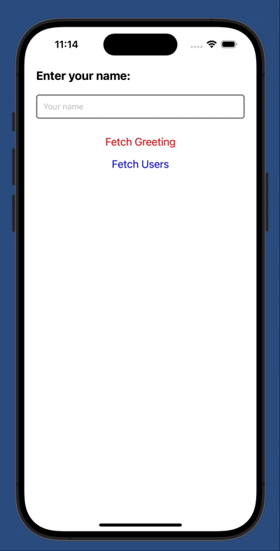

# trpc-react-native

This is a **simple** React Native application that demonstrates the use of **tRPC** for managing server communication and rendering a dynamic table in a mobile app. 

The app includes:
- A greeting feature where users can input their name and fetch a custom greeting.
- A user list fetched from the mock tRPC server and displayed in a table.

---

## Features

- **React Native:** Build cross-platform mobile apps.
- **tRPC:** Type-safe APIs for client-server communication.
- **TanStack Query:** Manage server state and caching efficiently.

---

## Demo


---

## Installation

1. Clone the repository:
   ```bash
   git clone https://github.com/RevanNasser/trpc-react-native.git
   cd trpc-react-native-demo

2. Install dependencies:
   ```bash
   yarn install
    # or
    npm install

3.Start the mock tRPC server:
   ```bash
npx ts-node mockServer.ts
```
4.Start the React Native app:
   ```bash
    npx expo start
